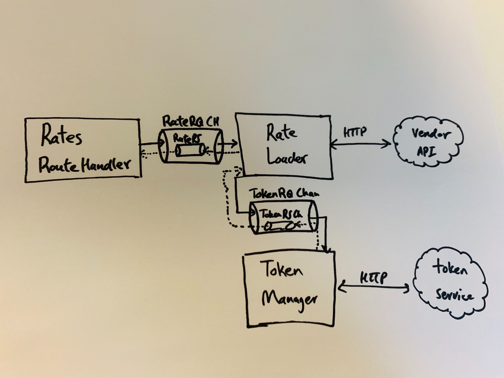
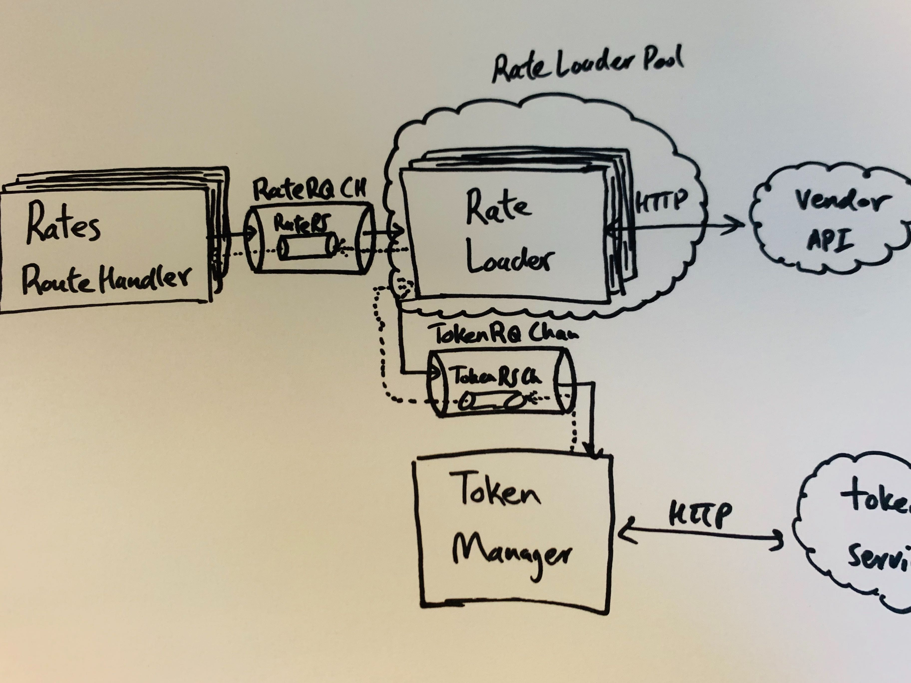

#  Writing Scalable Go Services

## Problem

How do we show the customer a complete set of relevant hotel rates before they
lose interest and close the tab? Despite trying various strategies to address
this, the team will likely continue to face this challenge in the future as user
expectations on speed and accuracy grow. The bottom line is, we need load a lot
of rates from many different vendors to show that we have as complete of an
inventory as any other travel site. And we need to do this fast.

Two of our main hotel vendors have announced major changes to the APIs we use to
load hotel rates. We saw this as an opportunity to reevaluate and improve the
backend services that interact with these APIs. To do this, we need to use
different strategies to load rates based on the vendor and their API contracts.
Most notably, some vendors allow us to get all available rates for multiple
hotels in a single request while others only give data on an individual hotel
basis.

The latter case causes a lot of bottleneck for the shopping flow because even
though the individual requests resolve fairly quickly, the time complexity grows
linearly with the number of hotels. This would scale poorly as we increase the
number of hotels we search. It also hinders user experience and confidence in
the service if the user has to wait several seconds or even minutes for the
search results to come back.

## Concurrency and Go

Since we have no influence on how our vendors' APIs are designed, it was clear
to the team that we had to parallelize our rates requests for individual hotels.
We are already parallelizing these requests in our services that interact with
the sunsetting APIs. The existing implementation uses Javascript promises to
create multiple concurrent requests for hotel rates. We wanted to evaluate this
implementation and look for ways to improve it by using a more suitable
programming language or paradigm that could help the efficiency and design of
our concurrent program.

If you are not familiar, `go` is a relatively new language and is designed based
on modern understanding of parallel computing. Its primitive types make
designing and building concurrant applications simple and fun. A `goroutine` can
be thought of an inexpensive and lightweight thread. A `channel` enables two or
more routines to communicate with each other, similar to a pipe. The language
also provides a multiway concurrent control switch through the `select`
statement, which enables interactions with multiple `channel`s. So, creating a
`goroutine` is cheap and we are able to use first-class primitives to facilitate
conversation between them. But how do we use these features to design and
implement a scalable service for gathering hotel rates?

## Communicating Sequential Processes

Concurrency in `go` is based on Tony Hoare's CSP, which specifies the patterns
of interactions between concurrent processes.  Unlike the traditional thread
model, CSP takes a message passing approach to ensure data integrity rather than
locks and mutexes. Go's `goroutines` and `channels` mediate access to shared
data by passing data references between processes and help structure concurrent
software. Independent components should run concurrently and communicate with
other components, if need be. This decouples concurrency from parallelism and
makes programs easier to digest. Concurrency is the composition of independently
executing processes and their interactions. Parallelism is the simultaneous
execution of multiple processes. Our goal should be to design a program that
will run correctly and as efficiently as possible, regardless of the underlying
resources available. We need to keep in mind that this program might not
actually run components in parallel.


## First Attempt

Following our agile mindset, we jumped into writing `go` and got to a MVP
quickly. We started by creating a solution that would simply use the concurrent
primitives in `go` to parallelize loading rates for each hotel. This new service
would receive a list of hotels and spawn a new `goroutine` to fetch rates for
each hotel. We used a buffered channel to aggregate the results from each
process.

```go

// given an array of hotel ids and seach params, concurrantly load rates for each hotel
func getRates(hotelIds []int, checkInDate string, checkOutDate string) []hotelWithRates {
   var rates []hotelWithRates
   ch := make(chan hotelWithRates, len(hotelIds))

   for _, hotelID := range hotelIds {
       // make http call to vendor for this hotel in a goroutine
       go getHotelRates(ch, hotelID, checkInDate, checkOutDate)
   }

   for range hotelIds {
       hotelWithRates := <-ch
       rates = append(rates, hotelWithRates)
   }

   if rates == nil || len(rates) < 1 {
       return rates, fmt.Errorf("no rates found for search criteria")
   }

   return rates, nil
}

```

We were quickly able to implement this solution and see an improvement in the
load time, which was a great proof of concept. However, there were some concerns
regarding the scalability, configurability, and maintainability, of this
solution. `goroutines` are cheap and a typical `go` program can spawn thousands
of them during its runtime. However, with this implementation we could
potentially spawn hundreds of routines at any moment. More concerning is that the
contents of the request have large consequences on the internal resources of the
application. Even if thoroughly validated the request to ensure it would not
abuse our internal resources, we were wary that this solution did not give us
the freedom to configure the resources we want to make available.

## The Worker Model

The proof of concept gave us confidence that we were on the right path, so we
decided to take the time to design a more robust concurrent model to address
some of our concerns. We began by identifying all the components that could
conceptually run independent of the others in the system. The white board gave
us the freedom to compose these independently executing modules and find areas
where we needed to add communication channels between them.

<p align="center">
    
</p>

The route handler, the token manager, and the rate loader were the three
components we identified as required for processing a request to load rates. It
was not immediately obvious how these components would run independently. The
rate loader takes a validated request from the route handler and needs a token
before contacting the vendor. However, we noticed that multiple rate loaders can
execute independently once they have all of the necessary info. Once we
facilitate proper communication between the components, we can start regarding
them as workers that receive required parameters from `channels`, perform their
task, and communicate result through `channels`. Groups of workers that perform
the same tasks can be regarded as a pool of workers. They all listen on a single
channel for requests they can process.

<p align="center">
    
</p>


How many rate loaders? It depends on the application, but this is now a
configurable parameter. It does not have to be an exact number either. One might
configure a lower and an upper bound for how many rate loaders they want in
their app and can add logic to dynamically scale to throw limits based on the
current load.

## Importance of Communication

As our vendor services have grown, we found that we would return to the white
board time and again whenever we added new features and functionality. The
discussion usually revolved around whether we needed to add another worker to
implement some trivial functionality. For example, we wanted to log all raw
communication to and from the vendor APIs, but since they were typically large,
we wanted to store them in S3. Since we already have a service that abstracts
the intricacies of using AWS S3 APIs, all we had to do was send a request to
this service along with what we wanted to get logged. This could be, and was,
initially implemented as a simple function call. Everywhere we wanted to log, we
would call this function and it was relatively simple.

But, this was not consistent with the rest of the system. When designing the
concurrent structure for loading rates, we were discussing how the program
should behave so that it matches. The program is composed of independently
executable components that are explicitly connected with channels.  It then
makes sense that any other independently executable component should be
implemented as another worker, connected to other workers if needed through a
channel. The clarity and consistency in the implementation not only helps new
engineers learn the code base quickly, but it also allows the team to discuss
whether the design makes sense as the program grows. The worker model might make
sense now, but if we see that we have to wrestle with a lot of issues as the
program grows, it becomes clear that we need to reevaluate the design.


## Helpful Links

<https://blog.golang.org/share-memory-by-communicating>
<https://medium.com/@1_00794/parallelism-models-actors-vs-csp-vs-multithreading-f1bab1a2ed6b>
<https://www.youtube.com/watch?v=cN_DpYBzKso>
<http://www.usingcsp.com/cspbook.pdf>


## REMOVE THESE IDEAS

> Do not communicate by sharing memory; instead, share memory by communicating.
