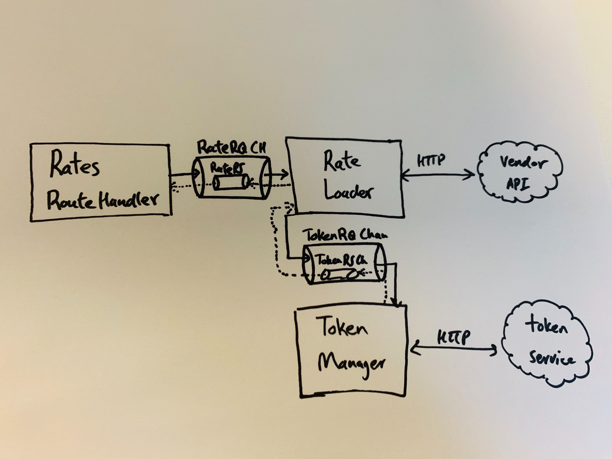
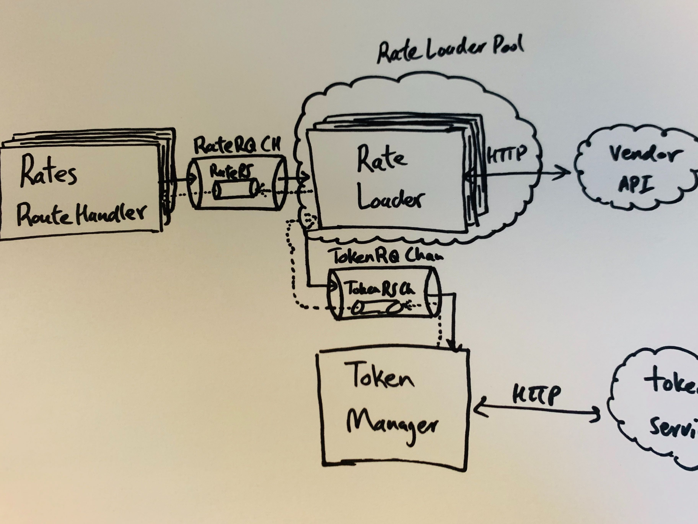

#  Writing Scalable Go Services

## Problem

How do we show the customer a complete set of relevant hotel rates before they
lose interest and close the tab? Despite trying various strategies to address
this, the team will likely continue to face this challenge in the future as user
expectations on speed and accuracy grow. The bottom line is, we need load a lot
of rates from many different vendors to show that we have as complete of an
inventory as any other travel site. And we need to do this fast.

Two of our main hotel vendors have announced major changes to the APIs we use to
load hotel rates. We saw this as an opportunity to reevaluate and improve the
backend services that interact with these APIs. To do this, we need to use
different strategies to load rates based on the vendor and their API contracts.
Most notably, some vendors allow us to get all available rates for multiple
hotels in a single request while others only give data on an individual hotel
basis.

The latter case causes a lot of bottleneck for the shopping flow because even
though the individual requests resolve fairly quickly, the time complexity grows
linearly with the number of hotels. This would scale poorly as we increase the
number of hotels we search. It also hinders user experience and confidence in
the service if the user has to wait several seconds or even minutes for the
search results to come back.

## Concurrency and Go

Since we have no influence on how our vendors' APIs are designed, it was clear
to the team that we had to parallelize our rates requests for individual hotels.
We are already parallelizing these requests in our services that interact with
the sunsetting APIs. The existing implementation uses Javascript promises to
create multiple concurrent requests for hotel rates. We wanted to evaluate this
implementation and look for ways to improve it by using a more suitable
programming language or paradigm that could help the efficiency and design of
our concurrent program.

If you are not familiar, `go` is a relatively new language and is designed based
on modern understanding of parallel computing. Its primitive types make
designing and building concurrent applications simple and fun. A `goroutine` can
be thought of an inexpensive and lightweight thread. A `channel` enables two or
more routines to communicate with each other, similar to a pipe. The language
also provides a multiway concurrent control switch through the `select`
statement, which enables interactions with multiple `channels`. So, creating a
`goroutine` is cheap and we are able to use first-class primitives to facilitate
conversation between them. But how do we use these features to design and
implement a scalable service for gathering hotel rates?

## Communicating Sequential Processes

Concurrency in `go` is based on Tony Hoare's CSP, which specifies the patterns
of interactions between concurrent processes.  Unlike the traditional thread
model, CSP takes a message passing approach to ensure data integrity rather than
locks and mutexes. Go's `goroutines` and `channels` mediate access to shared
data by passing data references between processes and help structure concurrent
software. Independent components should run concurrently and communicate with
other components, if need be. This decouples concurrency from parallelism and
makes programs easier to digest. Concurrency is the composition of independently
executing processes and their interactions. Parallelism is the simultaneous
execution of multiple processes. Our goal should be to design a program that
will run correctly and as efficiently as possible, regardless of the underlying
resources available. We need to keep in mind that this program might not
actually run components in parallel.


## First Attempt

Following our agile mindset, we jumped into writing `go` and got to a MVP
quickly. We started by creating a solution that would simply use the concurrent
primitives in `go` to parallelize loading rates for each hotel. This new service
would receive a list of hotels and spawn a new `goroutine` to fetch rates for
each hotel. We used a buffered channel to aggregate the results from each
process.

```go

// given an array of hotel ids and search params, concurrently load rates for each hotel
func getRates(hotelIds []int, checkInDate string, checkOutDate string) []hotelWithRates {
   var rates []hotelWithRates
   ch := make(chan hotelWithRates, len(hotelIds))

   for _, hotelID := range hotelIds {
       // make http call to vendor for this hotel in a goroutine
       go getHotelRates(ch, hotelID, checkInDate, checkOutDate)
   }

   for range hotelIds {
       hotelWithRates := <-ch
       rates = append(rates, hotelWithRates)
   }

   if rates == nil || len(rates) < 1 {
       return rates, fmt.Errorf("no rates found for search criteria")
   }

   return rates, nil
}

```

We were quickly able to implement this solution and see an improvement in the
load time, which was a great proof of concept. However, there were some concerns
regarding the scalability, configurability, and maintainability, of this
solution. `goroutines` are cheap and a typical `go` program can spawn thousands
of them during its runtime. However, with this implementation we could
potentially spawn hundreds of routines at any moment. More concerning is that the
contents of the request have large consequences on the internal resources of the
application. Even if thoroughly validated the request to ensure it would not
abuse our internal resources, we were wary that this solution did not give us
the freedom to configure the resources we want to make available.

## The Worker Model

The proof of concept gave us confidence that we were on the right path, so we
decided to take the time to design a more robust concurrent model to address
some of our concerns. We began by identifying all the components that could
conceptually run independent of the others in the system. The white board gave
us the freedom to compose these independently executing modules and find areas
where we needed to add communication channels between them.

<p align="center">
    
</p>

The route handler, the token manager, and the rate loader were the three
components we identified as required for processing a request to load rates. It
was not immediately obvious how these components would run independently. The
rate loader takes a validated request from the route handler and needs a token
before contacting the vendor. However, we noticed that multiple rate loaders can
execute independently once they have all of the necessary info. Once we
facilitate proper communication between the components, we can start regarding
them as workers that receive required parameters from `channels`, perform their
task, and communicate result through `channels`. Groups of workers that perform
the same tasks can be regarded as a pool of workers. They all listen on a single
channel for requests they can process.

<p align="center">
    
</p>


How many rate loaders? It depends on the application, but this is now a
configurable parameter. It does not have to be an exact number either. One might
configure a lower and an upper bound for how many rate loaders they want in
their app and can add logic to dynamically scale to throw limits based on the
current load.

## Sample Code

#### Main

```go
func main() {
	var wg sync.WaitGroup
	tokenRQChan := make(chan domain.TokenRQ)
	ratesRQChan := make(chan domain.RateRQ, rateLoaderCount*2)

	var tokenLoader = TokenLoader{
		In:   tokenRQChan,
	}
	var rateLoaderPool = RateLoaderPool{
		Count:         viper.GetInt("rateLoaderCount"),
		In:            ratesRQChan,
		TokenRQChan:   tokenRQChan,
	}

	appRouter := mux.NewRouter()
	appRouter.HandleFunc("/rates", RatesHandler(ratesRQChan))
	srv := http.Server{
		Addr:    viper.GetString("server.host") + ":" + viper.GetString("server.port"),
		Handler: appRouter,
	}

	wg.Add(1)
	go func() {
		tokenLoader.Start()
		wg.Done()
	}()

	wg.Add(1)
	go func() {
		rateLoaderPool.Start()
		wg.Done()
	}()

    // omitting implementation of gracefully shutting down all the workers
}
```

#### Rates Route Handler

```go
func RatesHandler(ratesRQChan chan domain.RateRQ) func(w http.ResponseWriter, r *http.Request) {
	return func(w http.ResponseWriter, r *http.Request) {
	    var rates []types.HotelRateInfo
	    rateRSChan := make(chan RateRS, len(r.HotelIds))
	    for _, hotelID := range r.HotelIds {
	    	ratesRQChan <- RateRQ{
	    		HotelID:                 hotelID,
	    		CheckInDate:             r.CheckInDate,
	    		CheckOutDate:            r.CheckOutDate,
	    		RateRSChan:              rateRSChan,
	    	}
	    }
	    for range p.HotelIds {
	    	res := <-rateRSChan
            rates = append(rates, res.HotelRateInfo)
	    }
		writeResponse(&w, createJsonResponse(r.Context(), rates, http.StatusOK))
	}
}
```

#### Rate Loader Pool

```go
type RateLoaderPool struct {
	Count         int
	In            chan RateRQ
	TokenRQChan   chan<- TokenRQ
	stop          chan struct{}
}

// Start initializes and starts n unique rate loader based on the Count parameter.
// Each rate loader listens for requests on the pool's In channel.
// For each request, a loader asks for a token through the TokenRQChan,
// gets rates from the vendor, and puts the result on the requests'
// desired response channel (RateRSChan).
func (rlp *RateLoaderPool) Start() {
	rlp.stop = make(chan struct{}, 1)
	var wg sync.WaitGroup
	for i := 0; i < rlp.Count; i++ {
		wg.Add(1)
		tokenRSChan := make(chan TokenRS)
		go func() {
		loop:
			for {
				select {
				case rq := <-rlp.In:

					// ask for a token from a token loader
					rlp.TokenRQChan <- TokenRQ{...}
					token := <-tokenRSChan

					// get rates for a hotel
					r := getRateFromVendor(...)

					rq.RateRSChan <- RateRS{r}
				case <-rlp.stop:
					break loop
				}
			}
			wg.Done()
		}()
	}
    // blocks until all workers in the pool have stopped
	wg.Wait()
}

// Stop stops all workers in the pool
func (rlp *RateLoaderPool) Stop() {
	close(rlp.stop)
}
```

#### Token Loader

```go
type TokenLoader struct {
	In   <-chan TokenRQ
	stop chan struct{}
}

// Start initializes and starts the token loader
func (tl *TokenLoader) Start() {
	tl.stop = make(chan struct{}, 1)
	var token *TokenRS
loop:
	for {
		select {
		case rq := <-tl.In:
			rq.TokenRSChan <- getAuthenticationToken(...)
		case <-tl.stop:
			break loop
		}
	}
}

// Stop token loader
func (tl *TokenLoader) Stop() {
	close(tl.stop)
}
```

## Importance of Communication

As these vendor services grow, the teams has had some discussions around how
much we should stick to the worker model as we add features. The debate usually
revolves around whether another worker or pool of workers is required to add
small features, which would normally be implemented as helper functions. For
example, a recent feature we added was the ability to log all interactions with
the vendors' APIs to S3. This feature was initially implemented with a simple
helper function that would take a JSON object and log it in our S3 bucket. To
ensure that the request to S3 did not block the regular flow, we called the
helper function in a `goroutine`.

This solution was not consistent with the rest of the system. Conceptually we
had added a component that could execute independently but effectively
communicating that as we did with other concurrent modules. The failure to
communicate clearly made this part of the program hard to follow and it would be
confusing to new engineers. Furthermore, we had moved away from the paradigm
identified as optimum for the problem. It would be difficult to accurately
assess the overall solution if we do not consistently follow and communicate the
strategy.

## Helpful Links

<https://blog.golang.org/share-memory-by-communicating><br/>
<https://medium.com/@1_00794/parallelism-models-actors-vs-csp-vs-multithreading-f1bab1a2ed6b><br/>
<https://www.youtube.com/watch?v=cN_DpYBzKso><br/>
<http://www.usingcsp.com/cspbook.pdf><br/>

